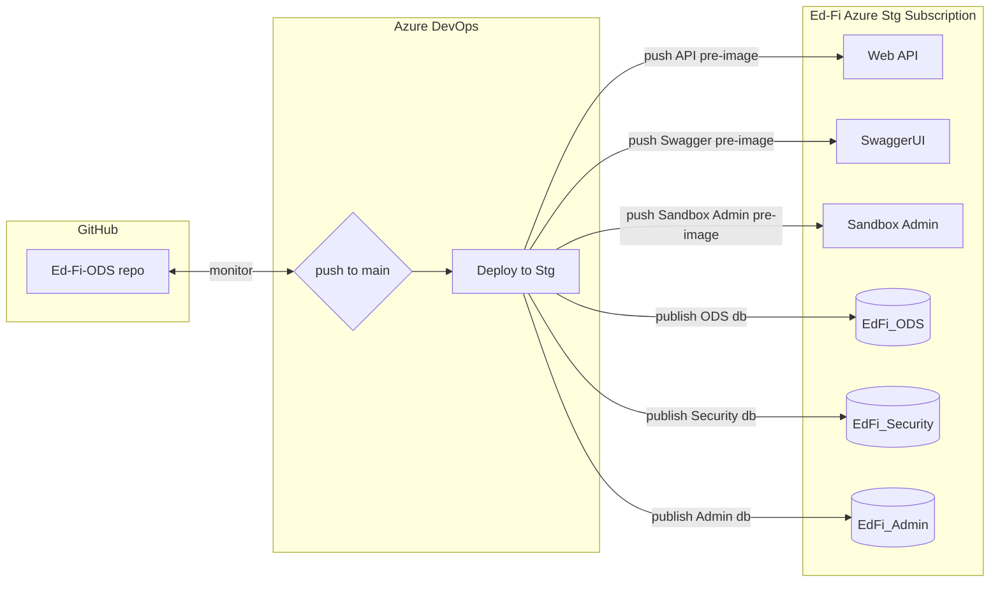
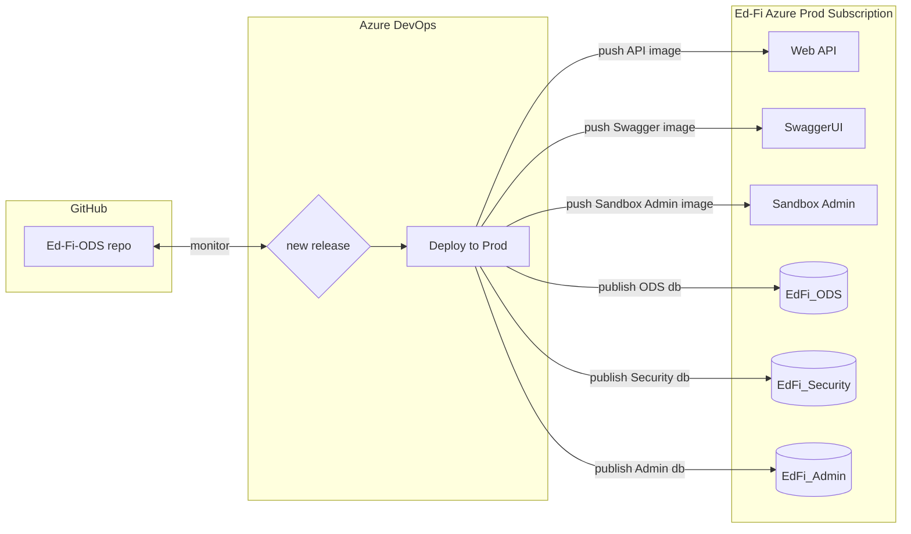
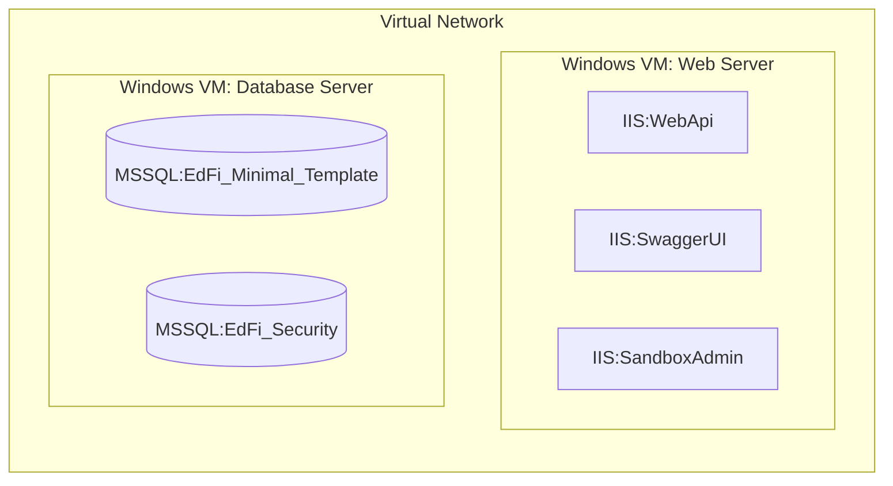
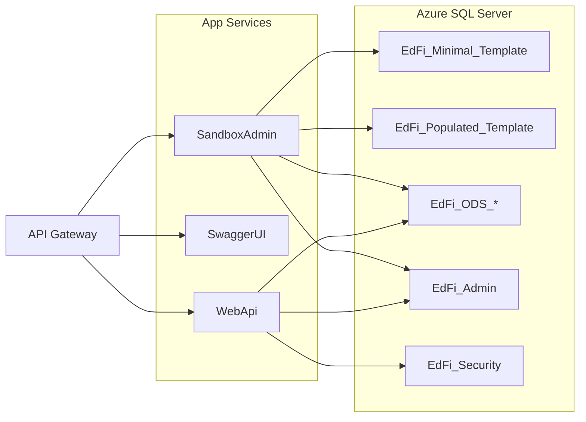
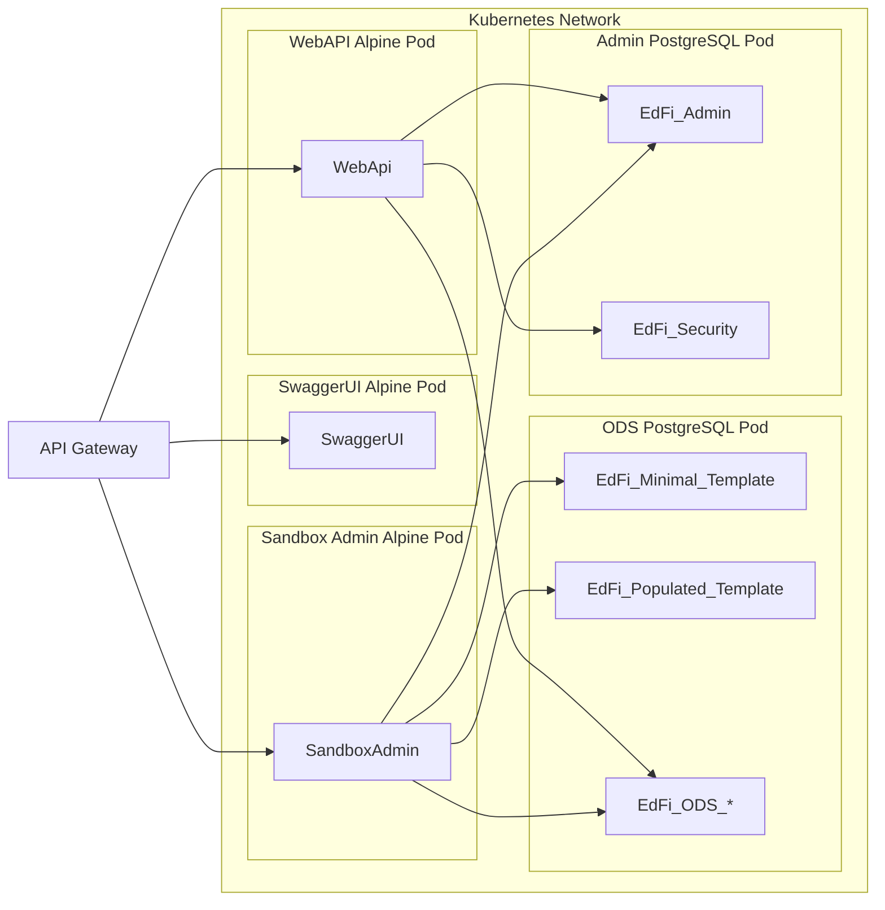

# Vision: Environments and Network Topologies

Three deployment environments are envisioned: Staging, Demonstration, and
Certification. In addition, we need to support multiple versions in parallel.
These multiple versions might be deployed into the same environment or into
replicated environments, depending on the deployment topology. As of Jan 4,
2024, the following versions are supported and need to be deployed:

* Staging: pre-release of the next ODS/API versions, 6.2 and 7.2.
* Demonstration: full release of 5.3, 6.1, and 7.1.
* Certification: full release of 5.3, 6.1, and 7.1.
  * And potentially older versions (5.0, 5.1, 5.2).

The three environments will have mirror network topologies. However, there are
several different topology options to consider.

> [!NOTE]
> The fastest approach to migration is likely lift-and-shift or app services.
> Stephen's preference, however, is for Kubernetes-based deployment.

## Environments

### Staging Deployments

### Demonstration Deployments

> [!NOTE]
> Historically the Alliance called this the "production" environment. Suggesting
> a name change to make it clear that this does not house any production
> services relied for transactional or reporting usage.

There are two core differences between the Staging and Demonstration
deployments:

1. Instead of monitoring the `main` branch, we're now monitoring for new
   releases (ignore _pre_ releases).
2. The deployments would now use the fully published Docker images and/or NuGet
   packages, rather than pre-releases.

### Certification Deployments

The Certification deployments would mirror the demonstration deployments, though
there may end up being additional requirements around "sub environments". The
Sandbox Admin tool is not ideal for managing more than six certification
sandboxes in parallel. If we need more than six, then we may need some sort of
subsidiary environment.

### Deployment Topology

There are several different deployment topologies that could be used for these
deployments, with different building blocks and different cost implications.

## Topologies

What will the deployments look like? Options to consider:

* Lift-and-shift
* Fully managed services
* Container services

### Lift-and-Shift

We may get the fastest migration with a lift-and-shift approach that essentially
mirrors the on-premises deployments.

These would be Windows-based virtual machines. Because these services do not
support actual production workloads, we should be safe with using the SQL Server
Developer edition licenses.

Because these are Windows VMs, at first glance this looks like it might be the
most expensive scenario. However, the matrix of different versions can be
installed in parallel onto the same machines, mimicking the pre-2024 on-premises
deployment topology. Thus while each VM is expensive, there would only need to
be a small number of them to support many different applications. This approach
might be particularly attractive for SQL Server cost management.

The

### Managed Services

Another approach is to make use of Azure's managed services, specifically API
Gateway, App Services, and Azure PostgreSQL. In this scenario, we likely need to
need to move to PostgreSQL for at least two reasons:

1. Current deployment tools for SQL Server require restoring a backup file
   (`.bak`) on the SQL Server, which is not natively supported / automatable
   with Azure SQL.
2. Cost savings.

This deployment strategy will _likely_ result in cost savings, because there is
no Windows licensing involved. However, there are also likely to be more
individual services running in parallel.

The web services might be run under Web App for Containers.

### Containers

Instead of running with App Services and Azure SQL, we could run Docker
containers in one of several modes:

1. App Services (Web App for Containers)
2. Azure Container Instances (ACI)
3. Azure Kubernetes Service (AKS)
4. Container Apps (Kubernetes-based and serverless)

In this scenario, AKS might be the preferred. Other modes may or may not realize
additional cost savings. However, AKS has one very large advantage: portability.
Kubernetes workloads can be tested and deployed on a laptop, on-premises, or on
any cloud provider.

In this scenario we might want to look at [KubeDB community
edition](https://kubedb.com/docs/v2023.12.28/setup/) to manage the PostgreSQL
pods. Also see [Run PostgreSQL in Azure Kubernetes Service (AKS) Using
KubeDB](https://appscode.com/blog/post/run-postgresql-in-aks/).

This deployment might look like:

